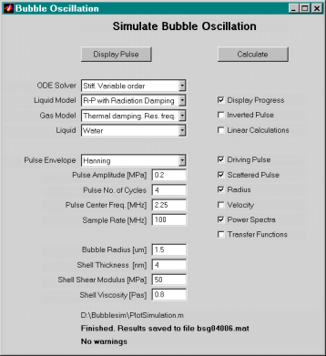
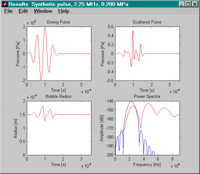

# Ultrasound Contrast Bubble Simulation
### Bubblesim Overview

- Simulator for estimating the radial oscillation and scattered sound from an ultrasound contrast bubble.
- Implemented as a toolbox in MATLAB.
- Updated and tested in Matlab ver. 7.0, originally written for Matlab 5.2
- Developed as a part of my doctoral studies at NTNU, The Norwegian University of Science and Technology.
- Main application is to simulate contrast agents for medical ultrasound imaging
- Designed for micrometer-sized bubbles exposed to Megahertz-frequency ultrasound.
- Only the radial oscillation mode is included, i.e. the oscillation is spherically symmetric.
- Nonlinear terms are fully included, the response is calculated by simulating an ODE in the time domain.
- Shell is included by a viscoelastic material model. Thickness and viscoelastic parameters of the shell must be specified by the user.

### Warning
Please be aware that this program is very experimental, and the documentation is not as extensive as it should be.

### Examples of use
An example of program operation is shown below. The left image is the graphical user interface used to specify bubble, pulse and calculation parameters. The right image shows the results of the simulation, containing the driving ultrasound pulse, the bubble radius and scattered sound pulse in the time domain, and the power spectra of the driving pulse and of the scattered sound.

  

## Documentation and Download
- Instructions for installation and brief description of operation: Readme-file as [pdf-document](\Documentation/Readme.pdf) (140 KB) or as [plain text-file](/Documentation/Readme.txt) (9 KB)
- Download Bubblesim as zip-file. (150 KB). The program consists of a collection of m-files written for Matlab, version 5.2 or above (The MathWorks Inc.)
- A brief description summarizing my approach to bubble and contrast agent simulation is found in the abstract presented at The Leading Edge in Diagnostic Ultrasound in Atlantic City, NJ, 8 May 2001. The abstract as pdf-document is found [here](/Documentation/abstract-leading-edge-diagnostic-ultrasound-2001.pdf) (18 KB). This document also includes several relevant references.
- A full desription of the theoretical models and some experimental data is found in the book “Acoustic Characterization of Contrast Agents for Medical Ultrasound Imaging”, Lars Hoff, Kluwer Academic Publishers, 2001. ISBN 1-4020-0144-4.
- A reference to a method used to estimate shell parameters is found in Hoff, Sontum and Hovem, “Oscillations of polymeric microbubbles: Effect of the encapsulating shell” J. Acoust. Soc. Am.  107, 2272-2280, (2000).

# Acknowledgment
Bubblesim was developed in collaboration with the Acoustics Group at the Department of Telecommunications and with the Department of Physiology and Biomedical Engineering , both at NTNU, the Norwegian University of Science and Technology, in Trondheim, Norway. We also appreciate the collaboration with and support from Amersham Health, former Nycomed Imaging, in Oslo, Norway.

# Contact
Since 2003, I am employed at the [University of South-Eastern Norway](https://www.usn.no/english/about/contact-us/employees/lars-hoff) in Horten, Norway

Comments, questions or suggestions: Contact: [lars.hoff@usn.no](mailto:lars.hoff@usn.no).
